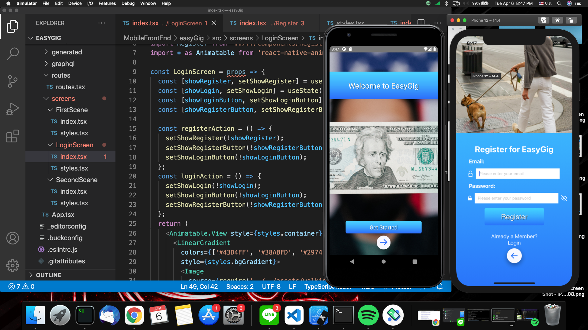

# EasyGig Job Posting

FullStack React Native TypeScript, GraphQL App for posting small and odd jobs in the community. -In progress CI/CD project

# TypeScript, TypeOrm, Express JWT, React Native w/ Hooks

# This app does not use Expo runs natively on respected device

EasyGig allows members of the community to make extra money by helping those who need lawn care, baby sitting, computer repair and other general work around the home or place of business.

This project uses the following technologies:

- [React Native](https://reactnative.dev/) and [React Navigation](https://reactnavigation.org/) for frontend
- [Yarn](https://yarnpkg.com/) and [Node.js](https://nodejs.org/en/) as the package manager
- [TypeScript](https://www.typescriptlang.org/) for maintaining consistency throughout the code base
- [TypeOrm](https://typeorm.io/#/) TypeORM supports both Active Record and Data Mapper patterns, unlike all other JavaScript ORMs currently in existence, which means you can write high quality, loosely coupled, scalable, maintainable applications the most productive way.
- [Express.js](https://expressjs.com/) Fast, unopinionated, minimalist web framework for Node.js
- [GraphQL](https://www.apollographql.com/docs/) GraphQL is a query language for APIs and a runtime for fulfilling those queries with your existing data. GraphQL provides a complete and understandable description of the data in your API, gives clients the power to ask for exactly what they need and nothing more, makes it easier to evolve APIs over time, and enables powerful developer tools.
- [ApolloClient](https://expressjs.com/) Apollo is a platform for building a data graph, a communication layer that seamlessly connects your application clients (such as React and iOS apps) to your back-end services.
- [Xcode](https://developer.apple.com/xcode/) With an all-new design that looks great on macOS Big Sur, Xcode 12 has customizable font sizes for the navigator, streamlined code completion, and new document tabs. Xcode 12 builds Universal apps by default to support Mac with Apple Silicon, often without changing a single line of code.
- [Android Studio](https://developer.android.com/studio/?gclid=CjwKCAjw07qDBhBxEiwA6pPbHpRPUCuKe-jtdsdpeUtfBDBLBXdoFiF-EcwrFwJwc2QE0NQ4dG6IjhoCboUQAvD_BwE&gclsrc=aw.ds) Android Studio provides the fastest tools for building apps on every type of Android device.

## Configuration

Please ensure you have all the above dependencies installed on your system including both Android Studio and Xcode w/Simulator for Mac or just Android Studio for Windows and Linux [React Native Environment Setup](https://reactnative.dev/docs/environment-setup)

-[Clone](https://github.com/derekwebdevcom/EasyGig.git) for Mac or -[Download Zip](https://github.com/derekwebdevcom/EasyGig/archive/refs/heads/master.zip) for Windows

## Quick Start:

// Yarn Install and npx pod-install cd server Yarn install.
yarn start in server directory & yarn ios or yarn android in root folder. GraphQL ports to
http://localhost:4000/graphql
